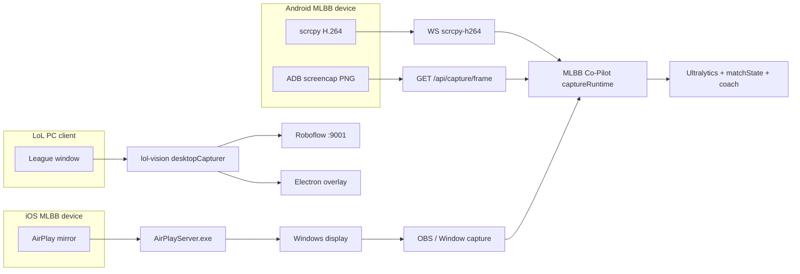

# External Repository Notes

Assessment of third-party repos shared for MLBB Co-Pilot integration research. **Read-only evaluation** — no vendored code, no dependency pins. Last reviewed: 2026-06-04.

| Repo | URL | Primary language | License (GitHub / repo) | Maintenance signal |
| --- | --- | --- | --- | --- |
| **scrcpy** | [Genymobile/scrcpy](https://github.com/Genymobile/scrcpy) | Java server + C client | Apache-2.0 | Very active: **v4.0**, official releases, ~130k★; client/server version must match exactly |
| AirPlayServer | [xenos1337/AirPlayServer](https://github.com/xenos1337/AirPlayServer) | C++ (SDL2, ImGui, FFmpeg) | MIT (`LICENSE` in repo; API reports `mit`) | Active: default branch commit **2026-06-03**, release **v1.1.0** (2026-03-03), ~76 stars, CI build/release workflow restored |
| lol-vision | [Shinobu-Kazahana/lol-vision](https://github.com/Shinobu-Kazahana/lol-vision) | TypeScript / Electron | README claims **MIT**; **no `LICENSE` file** in repo (GitHub license API 404) | Low activity: ~3 stars, last push **2026-05-26**, sparse commits (mostly README/assets); core logic is a small `src/` tree |

---

## MLBB Co-Pilot stack (mapping baseline)

Current capture and CV paths in this repo (for comparison):

| Layer | What we have today |
| --- | --- |
| **Capture** | **ADB PNG poll** (`adb exec-out screencap -p` via `GET /api/capture/frame` — testing/fallback), **backend scrcpy** (device `scrcpy-server` + H.264 socket → `WS /ws/capture/scrcpy-h264` → WebCodecs), **NDI**, **capture card** (UVC), browser **window** share, **OBS** native frame bridge (`/api/capture/obs/frame`, optional `modules/obs-scrcpy-source`) — see `frontend/src/runtime/captureRuntime.ts`, `backend/src/services/scrcpySource.ts`, `backend/src/services/adbFrameSource.ts` |
| **Live CV** | Region/anchor pipeline, screen classifier, draft icon/slot detectors, **Ultralytics YOLO** (screen-gated), minimap fusion — ingested via `ingestLiveVisionFrame` |
| **Offline CV** | Footage extract + **video CV review** (`backend/src/services/videoCvReview.ts`, `docs/video-cv-review.md`) |
| **State / coach** | `matchState`, `draftStabilizer`, OBS coach / advisory reasoning (`docs/coach-reasoning-model.md`) |
| **Platform** | Windows-first; Electron desktop shell; local inference (DirectML / WSL training), not cloud Roboflow in the hot path |

---

## 1. scrcpy (`Genymobile/scrcpy`)

### Summary

Official Android **screen mirror** over ADB (USB or TCP/IP). Architecture ([`doc/develop.md`](https://github.com/Genymobile/scrcpy/blob/master/doc/develop.md)):

- **`scrcpy-server`** — Java APK (`scrcpy-server.jar`) pushed to the device and run as `shell`; captures the display with framework privileges and encodes **H.264** (default), H.265, or AV1.
- **`scrcpy` client** — host binary that pushes the server, sets up `adb forward`, and reads **separate sockets** for video, audio, and control. Video is a **continuous encoded stream** with per-packet headers; the reference client decodes and displays with **minimal buffering** (~35–70 ms latency, 30–120 FPS depending on device and `-m` / `--max-fps`).

This is fundamentally different from **`adb shell screencap -p`**: each PNG screencap is a **full synchronous round trip** (capture → compress on device → pipe entire image → decode on host) with no temporal compression between frames.

### Why H.264/video beats repeated PNG screencap (latency / CPU)

| Factor | ADB PNG poll (this repo) | scrcpy H.264 path (this repo) |
| --- | --- | --- |
| **Per frame** | New `exec-out screencap -p`; full framebuffer as PNG every poll | Persistent tunnel; **delta** frames over one socket |
| **USB / ADB load** | Large bursty PNG payloads; client poll interval adapts to capture time (`≥250 ms` + capture ms) | Steady video bitrate (e.g. 6 Mbps live preset); encoder on device |
| **Host CPU** | PNG decode + canvas draw per poll | **WebCodecs** `VideoDecoder` on framed NAL units; queue shedding on backlog |
| **Live CV fit** | Explicitly logged as **testing, not low-latency realtime CV** in `captureRuntime.ts` | Default **Backend scrcpy** source; same `analyzeCanvas` / YOLO path as OBS/NDI after decode |
| **Typical FPS** | ~2–4 effective FPS under load (poll + 12s screencap timeout budget) | Server `max_fps` configurable; frontend caps at **`scrcpyMaxFps = 15`** for CV stability today |

PNG screencap remains useful for **diagnostics**, **draft simulator** stills (`data/cache/last-adb-frame.png`), and environments **without WebCodecs** (fallback message points to ADB Phone).

### What MLBB Co-Pilot already uses vs what could improve

**Already integrated**

| Piece | Location / behavior |
| --- | --- |
| Binary discovery | `SCRCPY_PATH`, `PATH`, `Downloads/scrcpy-win64-v4.0/scrcpy.exe` (+ `scrcpy-server`) — `backend/src/services/scrcpySource.ts` |
| REST control | `GET/POST /api/capture/scrcpy/status|start|stop` — `backend/src/routes/obsCoachRoutes.ts` |
| Direct server stream | `adb push` → `adb forward tcp:27183` → `com.genymobile.scrcpy.Server` **4.0** with `video_codec`, `max_fps`, `video_bit_rate` (no full `scrcpy` GUI required for CV) |
| H.264 fan-out | `GET /ws/capture/scrcpy-h264` — JSON `scrcpy_frame` meta + binary payload; framed packet parser matches scrcpy protocol |
| Live Capture UI | Source **Backend scrcpy** — `startScrcpy({ decoder: "h264", maxFps: 15, … })` + WebSocket decode — `frontend/src/runtime/captureRuntime.ts` |
| Optional mirror subprocess | `startScrcpy` without `decoder: "h264"` spawns `scrcpy --no-window` (background mirror for operators) |
| OBS alternate | `modules/obs-scrcpy-source` + `/api/capture/obs/frame` — same CV pipeline, different ingress |
| Setup diagnostics | `setupRoutes` scrcpy stream check; `data/recognition-samples/scrcpy-native-support.md` |

**Not used from upstream (by design or gap)**

- scrcpy **audio** socket, **HID** keyboard/mouse, camera source, OTG — out of scope for CV.
- Full **H.265 / AV1** end-to-end in the browser (backend rejects non-H.264 for live decode unless experimental flag).
- **Backend-side** decode to RGBA/BGRA for headless inference (today decode is **browser WebCodecs only**).
- Bundling scrcpy inside the Electron installer (operator supplies upstream zip; same as ADB platform-tools pattern).

**Could improve (prioritized)**

1. **P1 — Product default:** Prefer **Backend scrcpy** over **ADB Phone** in docs and first-run hints when `scrcpy-server` is present (PNG path stays for WebCodecs-less browsers and quick stills).
2. **P2 — Throughput:** Raise `scrcpyMaxFps` (15 → 30/60) when Ultralytics + draft stabilizer keep up; tune `videoBitRate` / `-m` max size per device.
3. **P3 — Backend decode:** Optional FFmpeg or native decoder in Node for CV workers/tests without Chromium — reuse same `tcp:27183` stream.
4. **P4 — H.265:** Wire WebCodecs + `startScrcpy` codec gate once low-latency path is validated on target GPUs.

### Integration (upstream binary + existing paths)

**Operator prerequisites:** USB debugging authorized; install official [scrcpy release](https://github.com/Genymobile/scrcpy/releases) (project docs assume **v4.0** server string). Windows: `scrcpy-win64-v4.0` under `Downloads` or `SCRCPY_PATH` / `SCRCPY_SERVER_PATH`.

**Live CV workflow (current)**

1. Live Capture → **Backend scrcpy** → Start.
2. Frontend `POST /api/capture/scrcpy/start` with `{ decoder: "h264", videoCodec: "h264", maxFps: 15, videoBitRate: 6000000, background: true }`.
3. Backend `startScrcpyH264` pushes server, forwards port **27183**, parses stream → `WS /ws/capture/scrcpy-h264`.
4. Frontend `VideoDecoder` → canvas → `analyzeCanvas` / `ingestLiveVisionFrame` (same as other live sources).

**ADB PNG fallback (current)**

- `GET /api/capture/frame` → `captureAdbPngFrame()` (`adb exec-out screencap -p`) — `adbFrameSource.ts`; frontend `pollAdbFrame()` loop.

Do **not** vendor scrcpy source into the monorepo; depend on the **upstream binary + matching `scrcpy-server`**.

### Risks

| Risk | Detail |
| --- | --- |
| **Version lock** | Client and server **must match** (e.g. `4.0`); mismatched zip causes opaque protocol failures. |
| **WebCodecs** | Live scrcpy preview/CV requires Chromium **VideoDecoder**; otherwise only PNG/ADB or OBS bridge. |
| **Wireless ADB** | Higher jitter than USB; may need lower resolution (`-m`) or FPS cap. |
| **Game / device** | Screen capture uses `shell` privileges; some OEMs add latency or block background capture — unrelated to scrcpy vs PNG choice. |

### Prioritized next steps (scrcpy)

1. **P1 — Docs/runbook:** State “live Android CV → Backend scrcpy; ADB PNG for diagnostics” in `docs/installing-mlbb-copilot.md` / CV docs (see cross-links below).
2. **P2 — Measure:** Compare draft slot stability at 15 vs 30 FPS on reference hardware; adjust `scrcpyMaxFps` if p95 inference keeps up.
3. **P3 — Backend decode spike:** Prototype Node frame tap from port 27183 for offline tools without Electron.

---

## 2. AirPlayServer (`xenos1337/AirPlayServer`)

### Summary

Windows-native **AirPlay 2 receiver** (fork/evolution of [fingergit/airplay2-win](https://github.com/fingergit/airplay2-win)). Advertises via **Bonjour/mDNS**, completes pairing over HTTP, receives **H.264** video (and AAC audio), decodes with **FFmpeg**, renders in an **SDL2** window with optional ImGui overlay. Quality presets: 30 FPS (Lanczos) or 60 FPS (bilinear / nearest-neighbor). Architecture is documented in-repo (`how-it-works.md`): `AirPlayServerLib` (RAOP/crypto), `airplay2dll`, `dnssd`, GUI in `AirPlayServer/`.

**Not a library SDK** — shipping artifact is `AirPlayServer.exe` (release zip `AirPlay2-Win-x64.zip`). Integration is inherently **process + display surface**, not a Node import.

### MLBB use cases

| Use case | Fit |
| --- | --- |
| **iPhone / iPad MLBB without USB** | Mirror iOS client to PC over Wi‑Fi when ADB/scrcpy is unavailable (iOS has no scrcpy path). |
| **Second capture lane for creators** | AirPlay window → existing **window share**, **OBS** scene, or **capture card** loop — same CV pipeline once pixels hit Co-Pilot. |
| **Draft / lobby review on iOS** | Same frames as Android if resolution/aspect is stable; still needs MLBB-specific ROIs/YOLO, not LoL assets. |
| **Android primary device** | **Poor fit** — AirPlay is Apple-only; Android remains ADB/scrcpy/NDI/HDMI. |

### Integration options (no vendoring)

1. **Documented operator workflow (lowest risk)**  
   Install Bonjour + `AirPlayServer.exe` → mirror phone → add OBS or browser **window** capture source in Live Capture. Reuse existing OBS bridge and calibration; no code coupling.

2. **OBS-first bridge**  
   Capture the AirPlay SDL window in OBS (Game Capture / Window Capture) → native OBS plugin path already posts frames to `/api/capture/obs/frame` and Ultralytics queue.

3. **Future: frame tap (high effort)**  
   Fork or extend C++ receiver to expose decoded RGBA/NV12 frames via named pipe/shared memory for direct ingest. Would duplicate scrcpy/NDI value only for iOS; maintenance burden on unofficial AirPlay stack.

4. **Not recommended**  
   Submodule entire `AirPlayServerLib` into backend — C++ build, FairPlay/crypto deps, and license mix (FFmpeg, SDL, etc.) fight the TypeScript/Electron monorepo model.

### Risks

| Risk | Detail |
| --- | --- |
| **Platform** | Windows x64 only; requires **Bonjour**, same-subnet Wi‑Fi, firewall rules. VMs need bridged networking. |
| **License / compliance** | Top-level **MIT**; README notes **constituent library licenses** (FFmpeg, etc.). **Unofficial AirPlay** — Apple trademark / protocol stability; not for redistribution inside Co-Pilot installer without legal review. |
| **Operational** | Extra latency vs USB scrcpy; 30–60 FPS cap; no headless API for automated tests. |
| **Product** | Does not replace ADB diagnostics, draft slot geometry, or `matchState` — only changes **how pixels arrive**. |

### Prioritized next steps (AirPlay)

1. **P2 — Runbook spike (1 session):** iOS device → AirPlayServer → OBS window source → verify draft HUD at project aspect profiles (`docs/cv-device-adaptation.md`). Record latency vs scrcpy.
2. **P3 — Docs only:** Add optional “iOS Wi‑Fi mirror” subsection to `docs/installing-mlbb-copilot.md` linking external binary (no bundling).
3. **Defer:** Any C++ frame bridge or installer bundling until iOS capture demand is validated.

---

## 3. lol-vision (`Shinobu-Kazahana/lol-vision`)

### Summary

Small **Electron** app (electron-react-boilerplate lineage) that:

- Polls every **200 ms** (`setInterval` in `src/main/main.ts`).
- Uses **`desktopCapturer.getSources`** + window title match (`League of Legends (TM) Client`) → PNG thumbnail (`src/lib/captureScreen.js`).
- POSTs image to a **local Roboflow Inference** server at `http://127.0.0.1:9001` (`leagueoflegends-kvjwx` / version `4`).
- Parses `played_champion` and drives a **transparent, click-through overlay** (`setIgnoreMouseEvents`, fullscreen, always on top).

README describes Docker inference, caching, and 60+ FPS; **implemented code is narrower** — single-class extraction, no multi-track state machine. Author notes capture ~**700 ms** in README (thumbnail path is the bottleneck). `package.json` still references ERB boilerplate metadata; no tests beyond scaffold `__tests__`.

### MLBB use cases

| Use case | Fit |
| --- | --- |
| **Process-targeted window capture in Electron** | Pattern reference only — Co-Pilot does **not** use `desktopCapturer` today; native ADB/scrcpy/OBS/NDI paths are preferred for fidelity. |
| **Transparent overlay for detections** | Useful **UX pattern** for future desktop overlay (draft timers, minimap pings) — align with OBS overlay strategy before duplicating in Electron. |
| **Roboflow HTTP infer loop** | **Weak fit** — this project standardizes on **local Ultralytics** + `inferUltralyticsFrame` / DirectML; Roboflow is optional tooling (`package.json` scripts), not the live loop. |
| **LoL model weights** | **No fit** — classes and training data are LoL-specific. |
| **Game-state / coach** | **No fit** — no draft stabilizer, lifecycle screen, or `matchState` integration. |

### Integration options (no vendoring)

1. **Pattern borrow — overlay shell (P3)**  
   If product needs in-game Electron overlay: study transparent window + IPC `object-detected` pattern; implement fresh in Co-Pilot with MLBB rects from `matchState`, not copy-paste (license file missing in upstream).

2. **Pattern borrow — window pick (P4)**  
   For emulator/PC MLBB window only: optional helper to resolve `desktopCapturer` source by title — **fallback** behind existing `window` capture; expect higher latency than scrcpy/OBS.

3. **Do not integrate**  
   Roboflow polling loop, LoL `projectId`, or Docker inference server as default — conflicts with offline/local CV contract and adds network dependency.

4. **Video CV / batch**  
   lol-vision does not address footage timelines; keep using `videoCvReview` and CV Studio batch paths.

### Risks

| Risk | Detail |
| --- | --- |
| **License** | MIT claimed in README but **no license file** — treat as **license unclear** for copy-paste until upstream adds `LICENSE`. |
| **Maintenance** | Minimal community (3★), README/marketing outpaces code; ERB cruft suggests inactive productization. |
| **Performance** | Thumbnail-based capture unsuitable for realtime draft CV vs 15 FPS scrcpy cap already documented in capture runtime. |
| **Anti-cheat / ToS** | README emphasizes avoiding Vanguard; MLBB mobile clients differ, but **overlays + CV on live clients** may violate game ToS — same policy caution as any live assistant. |
| **Stack drift** | Would fork Electron overlay while production capture investment is OBS/scrcpy/NDI — two capture philosophies. |

### Prioritized next steps (lol-vision)

1. **P4 — Architecture note only:** Link this doc from CV/capture discussions; no dependency.
2. **P3 — If overlay requested:** Prototype transparent Electron child window fed by **existing** `ingestLiveVisionFrame` / WS, do not adopt Roboflow loop.
3. **Defer:** Window-title `desktopCapturer` path for Android phones (not applicable).

---

## Cross-repo comparison

| Capability | scrcpy | AirPlayServer | lol-vision | MLBB Co-Pilot already |
| --- | --- | --- | --- | --- |
| Live pixel ingress | Android → H.264 stream | iOS → PC display | LoL window thumbnails | scrcpy WS, ADB PNG, NDI, OBS, capture card |
| Decode / format | H.264 (+ headers) on wire | H.264 → YUV/RGB (FFmpeg) | PNG blobs | WebCodecs (scrcpy), PNG (ADB), JPEG/BMP from OBS |
| Android phone | **Primary** | No | N/A | scrcpy + ADB fallback |
| ML inference | None | None | Roboflow HTTP | Ultralytics local + offline classifier |
| Game state | None | None | Single detection | Draft stabilizer, lifecycle, coach |
| Headless / API | CLI + socket | GUI app | Electron UI | Fastify + WS + batch review API |

---

## Recommended priority (combined)

| Priority | Action | Repo |
| --- | --- | --- |
| **P1** | Treat **Backend scrcpy** as default live Android capture; reserve **ADB PNG** for diagnostics / no-WebCodecs | scrcpy |
| **P2** | Tune `scrcpyMaxFps` and bitrate after on-device CV latency measurements | scrcpy |
| **P2** | Validate **iOS Wi‑Fi mirror → OBS/window → Live Capture** end-to-end; measure draft recognition quality vs USB scrcpy | AirPlayServer |
| **P3** | Optional install runbook mention (external binary, not shipped) | AirPlayServer |
| **P3** | If desktop overlay is on roadmap, spec **IPC overlay** using existing vision state (inspired by lol-vision UX, not code) | lol-vision |
| **P4** | Archive pattern reference only; clarify license with upstream before any file copy | lol-vision |
| **Avoid** | Vendoring scrcpy, C++ AirPlay lib, or lol-vision Roboflow loop into monorepo | scrcpy, AirPlay, lol-vision |

---

## References

- scrcpy README, [`doc/develop.md`](https://github.com/Genymobile/scrcpy/blob/master/doc/develop.md), [releases](https://github.com/Genymobile/scrcpy/releases)
- MLBB Co-Pilot: `backend/src/services/scrcpySource.ts`, `backend/src/services/adbFrameSource.ts`, `data/recognition-samples/scrcpy-native-support.md`
- AirPlayServer README, `how-it-works.md`, release [v1.1.0](https://github.com/xenos1337/AirPlayServer/releases/latest)
- lol-vision `src/main/main.ts`, `src/lib/captureScreen.js`
- MLBB Co-Pilot: `docs/cv-device-adaptation.md`, `docs/video-cv-review.md`, `docs/coach-reasoning-model.md`, `frontend/src/runtime/captureRuntime.ts`
