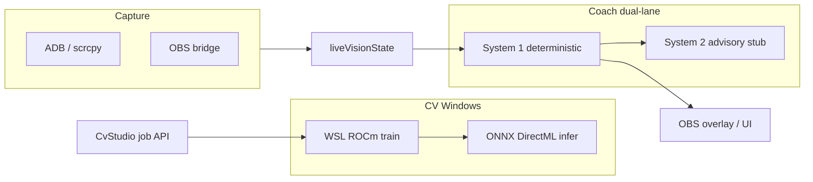

# Improvement Map

Review baseline: `main` at `59b8849` (2026-06-03). Scope: managed Ultralytics training jobs, WSL kill (`bash -c`), event-loop-safe training status, coach-scenario v2 + advisory lane, MLBB match logic doc, CvVideoTool per-frame labels, CI/docs.

**Verification note:** Several items below were addressed in `v0.5.0-desktop-alpha` work (see git history). Run `npm run release:gate` before tagging. CI on GitHub remains Linux build+test only.

**Recently addressed (0.5.x):** training rehydrate on boot, async job UX across CV pages, coach contract + expanded fixtures, dataset quality API, sidecar advisory HTTP client, CV Lab metadata schema, video review path constraints, `npm run release:gate`.

---

## Critical

| Finding | Impact | References |
| --- | --- | --- |
| ~~Training job not rehydrated on boot~~ | **Mitigated:** `rehydrateUltralyticsTrainingJob()` on server start; mock WSL integration tests in `tests/ultralyticsTrainingJob.integration.test.ts` | `backend/src/server.ts`, `ultralyticsTrainingJob.ts` |
| WSL train kill/orphan on real hardware | Still requires maintainer matrix on Windows+WSL; CI uses mocked probe/kill only | `data/cv/README.md` |
| ~~Coach fixture gap~~ | **Mitigated:** `coachScenarioContract.test.ts` + expanded `live-reasoning.json` (≤8 documented exemptions) | `tests/coachScenarioContract.test.ts` |

---

## High

| Finding | Impact | References |
| --- | --- | --- |
| ~~Dual training UX~~ | **Mitigated:** shared `useUltralyticsTrainingJob` on CV pages; legacy `/train` returns immediately with deprecation flag | `frontend/src/utils/useUltralyticsTrainingJob.ts`, `backend/src/server.ts` |
| Sidecar NPU multi-vendor routing | HTTP sidecar client exists; production NPU backends still phase 2 | `backend/src/engines/llmSidecarAdvisoryCoach.ts` |
| Electron release ships stale `backend/dist` if build skipped | `extraResources` copies prebuilt `backend/dist`; desktop can run old training/coach code after source edits | `package.json` (`build.extraResources`), `docs/release-checklist.md` |
| Local API has no auth; binds `127.0.0.1` by default | Acceptable for solo dev; risky if user exposes port via proxy/tunnel or runs on shared LAN | `backend/src/config.ts`, `backend/src/server.ts` (CORS allowlist) |
| GMS / Roboflow secrets via env and request body | `MLBB_GMS_AUTHORIZATION`, `ROBOFLOW_API_KEY` can leak in logs, issue attachments, or accidental commits | `backend/src/routes/syncRoutes.ts`, `backend/src/scripts/syncOfficial.ts`, `data/cv/README.md` |
| WSL poll every 2s runs `wsl.exe` + `pgrep` while training | Mitigated vs old heavy probes, but still adds subprocess load; can contribute to event-loop delay under load | `ultralyticsTrainingJob.ts` (`pollTrainingJob`, `probeWslProcesses`) |

---

## Medium

| Finding | Impact | References |
| --- | --- | --- |
| Debug ingest / Cursor agent `fetch` to local debug port | **Not found on `main` @59b8849** in `ultralyticsTrainingJob.ts` or `backend/src`. Treat as release gate: grep for `7242`, `debug-session`, `#region agent` before tagging | N/A on current main; user scope flagged prior WIP |
| ~~CvVideoTool fake mAP~~ | **Mitigated:** `GET /api/cv/dataset/quality` wired in CvStudio/CvVideoTool | `backend/src/services/cvDatasetQuality.ts` |
| Playwright smoke covers core routes only (no capture/GPU/CV train lifecycle) | Draft live-capture flows still need fixture video or mocked APIs | `e2e/`, `playwright.config.ts`, `.github/workflows/ci.yml` |
| Legacy `/api/vision/models/ultralytics/train` still public alongside job routes | Confuses API consumers; should deprecate or alias with clear job id in response | `backend/src/server.ts` |
| `trainUltralyticsModel` wait loop blocks one Fastify worker thread | Long train blocks other long requests on single-process dev server | `ultralyticsVision.ts` (`waitForUltralyticsTrainingJob`) |
| Dataset gaps only partially surfaced | Setup + CvStudio show quality hints; deeper class-gap UX still optional | `setupRoutes.ts`, `CvStudio.tsx` |
| OCR and multi-pipeline CV complexity | Operators may enable OCR before detection gates are stable; increases false match-state | `docs/known-limitations.md`, `screenTextRecognition.ts` |
| `data/cv/runtime/` gitignored | Correct for artifacts; training job file not in repo — document recovery/orphan cleanup | `.gitignore`, `ultralyticsTrainingJob.ts` |
| Roadmap docs split: `roadmap-1.0.md` vs new next-version doc | README still points only at 1.0 roadmap; easy to miss near-term milestone | `README.md`, `docs/roadmap-1.0.md` |

---

## Low

| Finding | Impact | References |
| --- | --- | --- |
| Advisory lane: no tests for `heuristicAdvisoryCoach` output shape / grounding | Stub quality regressions unnoticed | `tests/advisoryCoachLane.test.ts` (scheduling only) |
| `performanceMonitor` exists; not wired to structured export/alerting | Useful dev page; no release observability contract | `backend/src/services/performanceMonitor.ts`, `frontend/src/pages/PerformanceMonitor.tsx` |
| macOS/Linux Electron targets un-QA’d | Documented alpha limitation | `docs/known-limitations.md` |
| Module AI placeholder endpoint | `POST /api/modules/generate` is explicit placeholder | `backend/src/server.ts` |
| Container vs desktop feature parity | GHCR image lacks phone capture stack | `docs/known-limitations.md`, `publish-container` workflow |
| Match logic doc not linked from README table | Discoverability | `docs/mlbb-match-logic.md` |
| Co-authored / agent commits in history | Process hygiene only | `59b8849` message |

---

## Architecture Snapshot (for triage)

**Intentional split:** CV stays on GPU paths (DirectML infer, WSL train). Future **NPU/LLM advisory sidecar** is coach-only (`ADVISORY_SIDECAR_URL`), not on the CV hot path — align new work with `docs/coach-reasoning-model.md`.

---

## Suggested fix order (documentation-only pass)

1. P0: Training job rehydrate + orphan-process doc/runbook; unify frontend on async job APIs.
2. P0: Expand `live-reasoning.json` fixtures (or scenario table tests) to cover all v2 rule IDs.
3. P1: Release checklist: rebuild `backend/dist` before `desktop:dist`; grep release gate for debug ingest.
4. P1: Implement real `llm-sidecar` provider behind existing `AdvisoryCoach` interface.
5. P2: Dataset quality metrics API + CvVideoTool real val mAP from last run.
