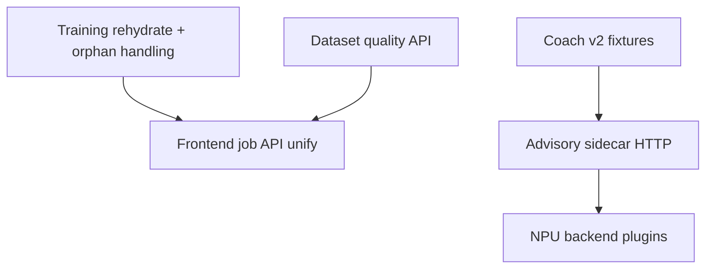

# Roadmap — Next Version

**Suggested label:** `v0.5.0-desktop-alpha` (package currently `0.5.0-desktop-alpha` in root `package.json`).

**Theme:** Harden the CV training lifecycle and ship a trustworthy desktop alpha, while keeping coach System 1 stable and opening the System 2 sidecar seam for multi-device NPU/LLM later.

**Relationship to `docs/roadmap-1.0.md`:** This document is the **next 1–2 release cycles** (0.5.x). The 1.0 roadmap remains the long-range public-release path.

---

## Success criteria (release gate for 0.5.x)

- [x] Start/stop WSL training from CvStudio survives backend restart without orphan `ultralyticsVision.py` processes — `rehydrateUltralyticsTrainingJob` + mock WSL integration tests (maintainer WSL matrix still required before tag).
- [x] All CV training entry points use the same async job API (`useUltralyticsTrainingJob`; legacy `/train` non-blocking).
- [x] `live-reasoning` contract test + fixtures; ≤8 documented exemptions (target: zero in v0.5.2).
- [x] `npm run build && npm test` green on CI; `npm run release:gate` and `cv:verify:draft-offline:ci` on Ubuntu. Local Windows: `cv:status`, `cv:wsl:status`, train/infer smoke per release checklist.
- [ ] `npm run desktop:dist` uses freshly built `backend/dist` and `frontend/dist` — **human:** run `npm run build` before `desktop:pack` / `desktop:dist`.
- [x] No debug ingest URLs in `backend/src` / `frontend/src` (`npm run release:gate` grep).
- [x] README links this roadmap + improvement map.

---

## Phase P0 — Must ship (0.5.0)

| Item | Effort | Depends on | Notes |
| --- | --- | --- | --- |
| **Training lifecycle hardening** | M–L | WSL ROCm env | Rehydrate job from `training-job.json` + `training-job-phase.json` on server boot; detect orphan PIDs; surface `stuck` + one-click stop in CvStudio |
| **WSL kill verification runbook** | S | Training jobs | Manual matrix: start → stop mid-epoch → stop when `stuck` → backend restart during train; verify `buildWslKillCommand` / `pgrep` probe |
| **Unify training UX on job APIs** | M | Training lifecycle | Migrate CvVideoTool, CvLab, CvModelEditor, Settings to `training/start` + polling (match CvStudio) |
| **Remove debug instrumentation** | S | — | Grep `7242`, `debug-session`, `#region agent`, `ingest` in vision layer before tag; not present on main @59b8849 — keep as release gate |
| **Coach v2 test contract** | M | — | Fixture per rule or snapshot test of `listCoachReasoningScenarios()` vs `evaluateLiveReasoning` |
| **Electron dist rebuild discipline** | S | — | Automate or document in `release-checklist.md`: `npm run build` before `desktop:dist` |

---

## Phase P1 — Should ship (0.5.1–0.5.2)

| Item | Effort | Depends on | Notes |
| --- | --- | --- | --- |
| **Advisory LLM/NPU sidecar (phase 1)** | L | P0 coach tests | Separate process on `127.0.0.1:8790`; implement `AdvisoryCoach` HTTP client when `ADVISORY_COACH_PROVIDER=llm-sidecar`; **coach only**, not CV |
| **Multi-vendor NPU advisory (phase 2)** | L | Sidecar phase 1 | Pluggable backends: AMD Vitis AI, Intel OpenVINO, Qualcomm QNN, DML+CPU fallback — selection via env, not compile-time |
| **Coach rules expansion** | M | `docs/mlbb-match-logic.md` | Jungle pathing, Retribution steal windows, tier-2 item powerspikes, comeback macro; keep System 1 deterministic |
| **CV dataset quality dashboard** | M | `cvAnnotation` | Per-class train/val counts, empty labels, Roboflow staging age; wire real last-run mAP in CvVideoTool (not placeholder) |
| **Deprecate blocking `/train`** | S | Unified UX | Return job id only; log warning for direct wait clients |
| **CI smoke expansion** | M | — | Optional workflow_dispatch job for lint/typecheck only; still no GPU on ubuntu — document Windows maintainer matrix in `data/cv/README.md` |
| **Secrets hygiene** | S | — | Redact auth in logs; `.env.example` for GMS/Roboflow; sync route never logs raw token |

---

## Phase P2 — Nice to have (0.5.x tail or 0.6.x)

| Item | Effort | Depends on | Notes |
| --- | --- | --- | --- |
| **Playwright smoke** | M | Unified training UX | CvStudio train panel + overlay advisory visibility |
| **Training integration test (mocked WSL)** | M | P0 hardening | Fake `wsl.exe` script for CI process lifecycle |
| **Structured observability** | M | performanceMonitor | JSON log fields for train state transitions, coach ruleId changes, vision confidence gate trips |
| **First-run setup ↔ training readiness** | M | 0.5 installer goals from `roadmap-1.0.md` | Link setup checks to `getUltralyticsStatus` + active job state |
| **LLM layer on rules engine (exploration)** | L | Sidecar P1 | Optional paraphrase/rationale only; must not override `ruleId` or primary callout (per `coach-reasoning-model.md`) |

---

## Dependencies (cross-cutting)

- **CV train (WSL ROCm)** and **infer (DirectML)** remain separate runtimes — do not route YOLO train through NPU.
- **Advisory** consumes normalized match state + System 1 output only (`advisoryCoachLane.ts`, `obsCoachState.ts`).

---

## Effort legend

| Size | Indicative |
| --- | --- |
| S | ≤2 days |
| M | 3–7 days |
| L | 1–3 weeks |

---

## Out of scope for 0.5.x (explicit)

- Per-device production YOLO models (see `docs/cv-device-adaptation.md`).
- GPU training in GitHub Actions.
- Moving CV inference to NPU (user direction: NPU for coach advisory only).

---

## Maintainer verification matrix (local Windows)

Run before tagging 0.5.0 (not automated in CI):

1. `npm run install:all && npm run build && npm test`
2. `npm run cv:status` and `npm run cv:wsl:status`
3. CvStudio: quick correction train → stop → full train cancel
4. Backend restart during active job → confirm UI warning + recovery steps
5. `npm run desktop:pack` after fresh build
6. Overlay: `instant_callout` + `advisory_lane` update on live test stream

Record results in release notes; link failures to `docs/improvement-map.md` items.
